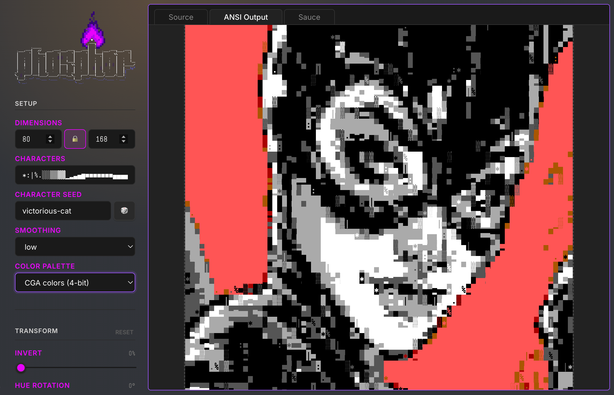

Phosphor
========

The app / a live demo is available at [phosphor.work](https://phosphor.work).

Convert images to ANSI art in the browser. Provide an image, tune the output with image adjustments and color quantization options, then export as a standard `.ans` or modern `.utf8ans` file — both with embedded [SAUCE](https://www.acid.org/info/sauce/sauce.htm) metadata.

[](https://phosphor.work)

## Development Setup & Usage

### Prerequisites
- **Node.js**: Version 18+
- **npm**: Version 9+

### Commands
```bash
npm install       # Install dependencies
npm run dev       # Start dev server at http://localhost:5173
npm run build     # Create production build in dist/
npm run preview   # Preview the production build locally
npm run lint      # Run ESLint
```

## Features

- **Export in two formats**
  - `.ans` — Uses the legacy **CP437** character set (standard for DOS/BBS).
  - `.utf8ans` — Uses modern **UTF-8** character encoding.
- **Color Flexibility** — Any quantization mode (CGA, VGA, or 24-bit TrueColor) can be used for both file formats.
- **Image adjustments** — smoothing, dimensions, brightness, contrast, saturation, hue rotation, invert, etc.
- **Color quantization** - full color, CGA 16, VGA 256, or reduce to N colors (MMCQ) or a custom palette
- **Randomized characters** - achieve various aesthetic foundations with a seedable RNG to generate character noise 
- **SAUCE metadata** - title, author, group, date, font name, ice color flag
- **Memory** - all settings persist across sessions via localStorage, but can be reset

## How it works

The image is drawn onto an off-screen canvas at `cols × (rows × 2)` pixels. Each pair of vertically adjacent pixels maps to one character cell: the top pixel becomes the background color, and the bottom pixel becomes the foreground color, using `▄` (U+2584 LOWER HALF BLOCK) as the character. This doubles the effective vertical resolution for the same character count. The character used for the foreground character can be randomized from a set of possible characters provided in the Setup panel.

An optional color quantization pass replaces every pixel color with the nearest color from the chosen palette before the character assignment step.

The exported file is a flat byte stream of ANSI escape sequences followed by a 128-byte SAUCE record.

## Compatibility Note

While Phosphor allows you to export high-color data (VGA 256 or 24-bit TrueColor) into standard `.ans` files, most legacy ANSI viewers and editors only support the basic 16-color CGA palette.

For proper viewing and editing of advanced color `.ans` files, check out the **[Advanced Color fork of the Moebius editor](https://github.com/christiansacks/moebius)**.

## Output formats

| Format     | Color                                        | Characters | Newlines          |
|------------|----------------------------------------------|------------|-------------------|
| `.ans`     | Legacy CGA SGR or Xterm-256 / TrueColor      | CP437      | none (raw stream) |
| `.utf8ans` | 24-bit `ESC[38;2;R;G;Bm` / `ESC[48;2;R;G;Bm` | UTF-8      | `\r\n` per row    |

## Credits

ANSI art preview and rendering was initially powered by the [play](https://github.com/nicholasstephan/play) creative-coding runtime by [ertdfgcvb](https://ertdfgcvb.xyz/), but it's since been adapted into a minimal subset of the functionality. I wanted to credit that work as the initial inspiration for the project, and suggest checking it out as something that's pretty awesome in its own right.

## License

Phosphor is released under the MIT license:

* https://opensource.org/licenses/MIT

Copyright 2026 [jejacks0n](https://github.com/jejacks0n)

## Make Code Not War